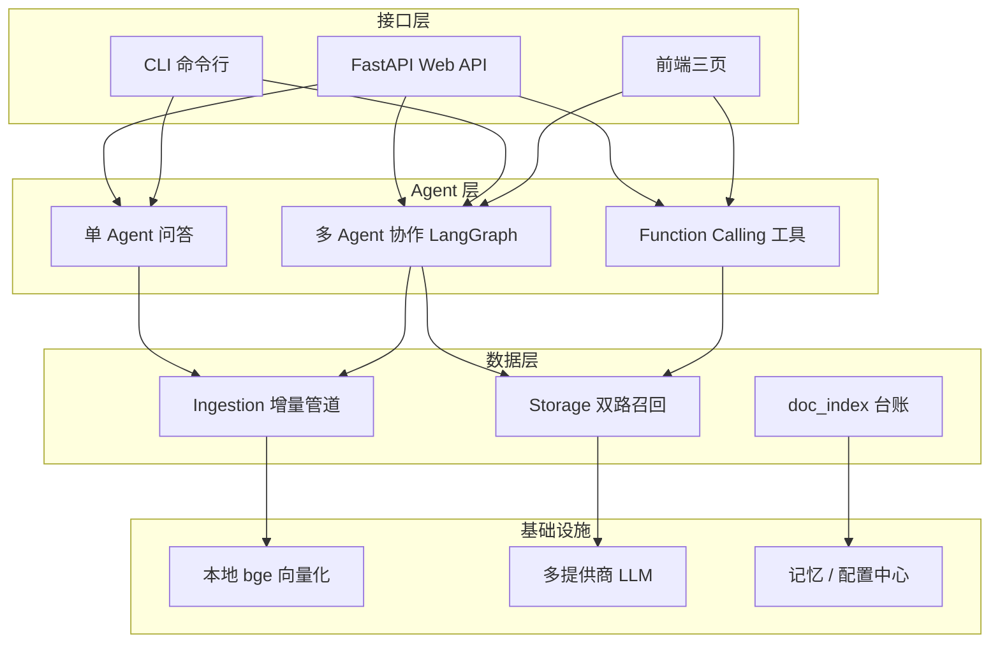

# kb-v2 · 个人知识库系统（RAG + 多 Agent 问答）

> RAG-based personal knowledge base with LangGraph multi-agent Q&A.

把 `.md / .docx / .pdf` 笔记丢进 `knowledge/raw/`，系统自动完成**增量入库 → 分块 → 语义打标 → 向量化 → 登记台账**，即可通过 Web / CLI 进行检索问答。检索采用**向量（bge-small-zh）+ BM25 关键词双路召回 + 图谱关联文档三路召回 → 交叉编码器重排**，问答支持**单 Agent**、**LangGraph 多 Agent 协作**与 **Function Calling 工具调用**。

## 核心特性

- 📥 **自动增量入库**：hash 对比台账，只处理新增/修改的文档，未变文档零重复计算
- 🏷️ **标签自治**：LLM 零样本 + embedding 语义复用，冷启动无需标注数据（阈值经 101 篇实测校准）
- 🔍 **三路混合检索 + 重排**：Chroma 向量（本地 bge 嵌入，离线免费）+ BM25 关键词保底 + 图谱关联文档，融合后经交叉编码器 `bge-reranker-base` 精细重排
- 🕸️ **知识图谱**：双层图谱——元数据层（文档-领域-标签，零 LLM）自动构建 + 实体层（LLM 增量抽取三元组），前端 Canvas 力导向可视化，检索时实体命中自动拉关联文档进候选池
- 🤖 **多 Agent 协作**：LangGraph 编排 Planner → Retriever → Answerer → Reviewer，审查不通过自动打回重写（≤3 轮）
- 🛠️ **Function Calling**：知识库检索 / 子进程安全执行 Python / 联网搜索，LLM 自主决定调用
- 🧠 **长期记忆**：跨会话用户画像（facts / prefs / goals）自动提炼并回灌
- 🌐 **Web 四页互通**：问答 / 知识库管理 / 知识图谱 / 评估仪表盘，SSE 流式输出，导入进度弹窗
- ✅ **可评测**：pytest 75/75 全绿，自带检索 benchmark 与 Agent 自动评测框架

## 架构



**依赖方向只从上往下**：接口层 → Agent 层 → 数据层 → 基础设施，底层不感知上层存在，各层可独立测试与替换。

## 快速开始

```bash
# 1. 安装
python -m venv .venv
pip install -r requirements.txt        # Windows: .\.venv\Scripts\pip install -r requirements.txt

# 2. 配置（可选，不配 key 也能以 mock 模式跑通流程）
cp .env.example .env                   # 填入 DEEPSEEK_API_KEY 等任意一家 key

# 3. 启动 Web（打开 http://127.0.0.1:8000）
python -m uvicorn main:app --host 0.0.0.0 --port 8000

# 4. 命令行
python -m kb.cli scan                   # 查看哪些笔记变更
python -m kb.cli ingest                 # 增量入库
python -m kb.cli ask "装饰器是什么"      # 单 Agent 问答
python -m kb.cli list                   # 查看库中文档
```

> 向量化使用本地 `BAAI/bge-small-zh-v1.5` 模型，全程离线免费；仅 LLM 问答需要 API key。

## 检索效果（23 例基准，`tests/benchmark_retrieval.py`，2026-09-13）

| 指标 | 纯向量基线 | 混合检索 | 三路召回 + 重排（当前） |
|---|---|---|---:|
| filtered hit@1 | 0.609 | 0.783 | **0.913**（+16%） |
| filtered MRR | — | 0.804 | **0.928** |
| filtered Recall@5 | — | — | **0.957** |
| global hit@1 | 0.348 | 0.435 | **0.652**（+30%） |
| global MRR | — | 0.514 | **0.696** |
| global Recall@5 | — | — | **0.783** |

> 关键改进：① 扩大召回（无标签时向量通道 top_k×5 → **top_k×8**，BM25 10→30，rerank 窗口 30→50，让整本书型 PDF 的正确 chunk 先进候选池）；② 交叉编码器加分微调（以池内最低分为基线，分差×权重 0.25 并入融合分，不颠覆融合排序）；③ **benchmark 标注有效性校验**（全文扫描确认 4 个混淆用例的期望源内容真实存在，修正无效标注）。详情见 `docs/开发手册.md` 与 `docs/踩坑手册.md`。

## Agent 评测（50 例，`tests/agent_eval.py`）

- 来源命中率（source_hit_rate）：**84.6%**
- RAG 类回答命中率：**97.4%**
- 工具判定精确率 / 召回率：**100% / 100%**
- 测试基线：**pytest 75/75 全绿**

## 技术栈

| 类别 | 选型 |
|---|---|
| Web | FastAPI · Uvicorn · 原生 HTML/CSS/JS（SSE 流式） |
| 向量库 | ChromaDB（本地持久化） |
| 嵌入 | sentence-transformers · BAAI/bge-small-zh-v1.5 |
| 重排 | sentence-transformers CrossEncoder · BAAI/bge-reranker-base（懒加载，缺失自动降级） |
| 检索 | 向量余弦 + BM25（jieba 分词 / rank-bm25）+ 图谱关联，加权融合后交叉编码器重排 |
| 知识图谱 | 自建 JSON 图（doc/topic/tag/entity 四类节点）· LLM 三元组抽取 · Canvas 力导向可视化 |
| Agent | LangGraph（StateGraph 多节点编排）· Function Calling（OpenAI 兼容接口） |
| LLM | DeepSeek / OpenAI 兼容多提供商，无 key 自动降级 mock |
| 文档解析 | pypdf · python-docx |

## 目录结构

```
kb-v2/
├─ main.py                 # FastAPI 入口（/api/chat /api/ingest /api/graph /api/eval/results）
├─ kb/                     # 代码包
│   ├─ agents/             #   单 Agent / LangGraph 多 Agent / 工具注册表
│   ├─ ingestion/          #   扫描 / 分块 / 打标 / 增量管道
│   ├─ kg/                 #   知识图谱（构建 / 存储 / 检索增强）
│   ├─ storage/            #   Chroma 向量库（三路召回+重排） / 台账
│   ├─ rerank.py           #   交叉编码器重排（懒加载 + 静默降级）
│   └─ embedding.py llm.py prompts.py memory.py web_search.py config.py
├─ static/                 # 前端四页（问答 / 管理 / 知识图谱 / 评估仪表盘）
├─ tests/                  # pytest 75 例 + 检索 benchmark + Agent 评测 + Agent 评测
├─ scripts/                # 运维脚本（build_graph / clear_chroma 等）
├─ knowledge/              # 数据层（raw 原始笔记 / 台账 / 图谱 / 向量库，均可重建）
├─ person_document/        # 项目文档（面试八股深挖.md 公开；其余本地维护）
├─ kb_config.yaml          # 知识库配置（分块、召回、重排、图谱、Agent、打标参数）
└─ requirements.txt
```

## 测试与评测

```bash
python -m pytest -ra -q                        # 75/75 全绿
python tests/benchmark_retrieval.py --no-ingest  # 检索 benchmark（重排开启时含模型加载）
python scripts/build_graph.py                  # 构建知识图谱（--entities 加 LLM 实体抽取）
python tests/agent_eval.py                     # Agent 自动评测（50 例）
```

---

# 开发备忘（维护者向）

> 更新：2026-09-13 ｜ pytest 69/69 ｜ 重排 + 知识图谱已上线 ｜ 已推 GitHub

## 当前状态

- **pytest 75/75 全绿**（chunk_cache 27 + memory 18 + retrieval 5 + hybrid_retrieval 10 + rerank 4 + kg 5 + tool_pool 6）
- **重排已上线**：`bge-reranker-base` 交叉编码器，**加分微调**策略（实测直排会把融合排序的正确结果打乱：async_03 融合分第 1 被打到第 7）；配合**扩大召回**（无标签向量通道 top_k → top_k×5），filtered hit@1 0.783 → **0.826**、global hit@1 0.435 → **0.522**；模型缺失/失败静默降级
- **知识图谱已上线**：元数据层（doc/topic/tag，零 LLM）+ 实体层（LLM 增量抽取，131 篇实测 726 三元组）；图谱 1259 节点 / 2202 边；检索第三路召回（实体/标签命中 → 关联文档加权进池）；前端图谱可视化页（Canvas 力导向 + 拖拽/hover/筛选）
- **前端四页互通**：新增知识图谱页，纳入 common.js 导航体系

## 遗留事项（按优先级）

1. **agent_confusion 剩余 4 例**（agent_04、react_03、langchain_01/02）：整本书型 PDF 正确 chunk 即使扩召回后仍被相关笔记压过（hit@3 已 0.5，MRR 0.167）。下一步："仅整本 PDF 类"文档先验（需防误伤）或池再扩大
2. **重排延迟**：bge-reranker-base 首次加载约数秒（约 1GB 模型）；CPU 打分 30 对约 3-5 秒。本地单用户够用；多并发场景可换小模型或降 top_n
3. **实体抽取成本**：131 篇全量抽取约 10 分钟 + 少量 token 费用；已做增量（hash 对比），后续入库只抽新增
4. **老代码限制**：splitter 超长段无硬切 / tool_agent 每问必跑一次 LLM / execute_python 非真沙箱（对外开放需 Docker）
5. **路线图**：阶段 6 compiled_wiki / 阶段 7 有监督标签（样本 100+）/ 阶段 8 多知识库 / 图谱二跳扩展与 GraphRAG 上下文拼装

## 技术坑速查（勿再犯）

1. **chromadb API 视图 bug**：count()/get()/list_collections() 返回过期数据，query() 正确；清理直接操作 sqlite
2. **safe-delete hook**：拦 rmtree/unlink → 走 trash → fail-closed，别依赖删除成功
3. **双 Python 解释器**：一切用 venv；mock 提示 = 运行解释器缺 openai，与 .env 无关
4. **chunk_cache 是耗时大头**：benchmark 已改为不删它；误删全量重建 5-8 分钟
5. **HNSW 退化**：多次 delete+upsert 后 top1 漏召回，重建 collection 即可
6. **前端 DOM 访问必须判空**：缓存旧页+新 JS 会 null.style（manage.js 已用 el() 判空）
7. **加分无法翻越恒定分差 / 聚合加分防长文档碾压**：见开发记录
8. **并发编辑以磁盘为准**：多工具同改一批文件时，Edit 前先 Read 现状

## 检索机制要点

- `kb/storage/vector_store.py`：`query(question, topic="", top_k=0, tags=None)` 返回 `{text, source, topic, heading, tags, score, rerank_score?}`
- 三路召回：向量（bge 余弦，主）+ BM25（`_search_by_bm25` 保底 `bm25_top_k` 进候选池；`_rerank_by_bm25` 按"命中查询词数/总数 × boost"并入 score）+ 图谱（`_search_by_graph`：问题命中实体/标签 → 关联文档片段加 `graph_boost` 进池）
- 重排：`kb/rerank.py` 交叉编码器对融合排序后的候选池前 `rerank.top_n` 条打分，`rerank_score` 重排，不覆盖原 score；模型不可用静默降级
- 配置 `recall {top_k: 4, score_threshold: 0.45, bm25_boost: 0.10, bm25_top_k: 10}` + `rerank {enabled, model, top_n: 20}` + `kg {enabled, graph_boost: 0.05, expand_top_n: 5}`
- `_HAS_BM25=False` 时静默降级纯向量；35 标签词注入 jieba 用户词典

## 知识图谱机制要点

- `kb/kg/build.py`：元数据层从台账构建 doc/topic/tag 节点边（零 LLM）；实体层 `KG_EXTRACT_PROMPT` 抽 (head, rel, tail) 三元组，增量按 doc_meta hash 对比
- `kb/kg/retrieve.py`：`expand_sources(question)` 问题命中 entity/tag 节点名 → 一跳（节点→文档）+ 二跳（实体关系邻居）拉关联文档
- `kb/kg/store.py`：`knowledge/graph/kg.json` 持久化（nodes/edges/doc_meta）
- API：`GET /api/graph` 读图谱 · `POST /api/graph/rebuild` 后台重建（可带 `extract_entities`）· `GET /api/graph/status` 轮询
- 前端 `static/graph.html`：Canvas 力导向图（斥力/弹簧/引力/阻尼），类型筛选、拖拽、悬停高亮邻居 + tooltip

## 文档索引

| 文档 | 内容 |
|---|---|
| `README.md` | 本文件：公开介绍 + 开发备忘 |
| `person_document/面试八股深挖.md` | 项目深度面试问答（公开） |
| 项目文档.md / 开发记录.md | 本地维护，未公开（`.gitignore` 忽略 `person_document/`） |

## License

[MIT](LICENSE) © 2026 Jesse-qil
