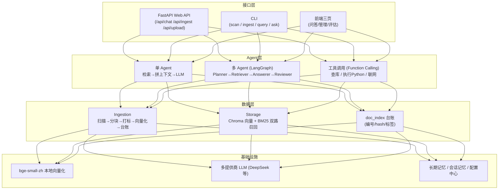

# kb-v2 · 个人知识库系统（RAG + 多 Agent 问答）

> RAG-based personal knowledge base with LangGraph multi-agent Q&A.

把 `.md / .docx / .pdf` 笔记丢进 `knowledge/raw/`，系统自动完成**增量入库 → 分块 → 语义打标 → 向量化 → 登记台账**，即可通过 Web / CLI 进行检索问答。检索采用**向量（bge-small-zh）+ BM25 关键词双路召回**，问答支持**单 Agent**、**LangGraph 多 Agent 协作**与 **Function Calling 工具调用**。

## 核心特性

- 📥 **自动增量入库**：hash 对比台账，只处理新增/修改的文档，未变文档零重复计算
- 🏷️ **标签自治**：LLM 零样本 + embedding 语义复用，冷启动无需标注数据（阈值经 101 篇实测校准）
- 🔍 **双路混合检索**：Chroma 向量（本地 bge 嵌入，离线免费）+ BM25 关键词保底加权融合
- 🤖 **多 Agent 协作**：LangGraph 编排 Planner → Retriever → Answerer → Reviewer，审查不通过自动打回重写（≤3 轮）
- 🛠️ **Function Calling**：知识库检索 / 子进程安全执行 Python / 联网搜索，LLM 自主决定调用
- 🧠 **长期记忆**：跨会话用户画像（facts / prefs / goals）自动提炼并回灌
- 🌐 **Web 三页互通**：问答 / 知识库管理 / 评估仪表盘，SSE 流式输出，导入进度弹窗
- ✅ **可评测**：pytest 60/60 全绿，自带检索 benchmark 与 Agent 自动评测框架

## 架构



**依赖方向只从上往下**：接口层 → Agent 层 → 数据层 → 基础设施，底层不感知上层存在，各层可独立测试与替换。

## 快速开始

```bash
# 1. 安装
python -m venv .venv
pip install -r requirements.txt        # Windows: .\.venv\Scripts\pip install -r requirements.txt

# 2. 配置（可选，不配 key 也能以 mock 模式跑通流程）
cp .env.example .env                   # 填入 DEEPSEEK_API_KEY 等任意一家 key

# 3. 启动 Web（打开 http://127.0.0.1:8000）
python -m uvicorn main:app --host 0.0.0.0 --port 8000

# 4. 命令行
python -m kb.cli scan                   # 查看哪些笔记变更
python -m kb.cli ingest                 # 增量入库
python -m kb.cli ask "装饰器是什么"      # 单 Agent 问答
python -m kb.cli list                   # 查看库中文档
```

> 向量化使用本地 `BAAI/bge-small-zh-v1.5` 模型，全程离线免费；仅 LLM 问答需要 API key。

## 检索效果（23 例基准，`tests/benchmark_retrieval.py`）

| 指标 | 纯向量基线 | 混合检索（向量 + BM25） |
|---|---:|---:|
| filtered hit@1 | 0.609 | **0.783**（+28.6%） |
| filtered MRR | — | 0.804 |
| global hit@1 | 0.348 | **0.435** |

## Agent 评测（50 例，`tests/agent_eval.py`）

- 来源命中率（source_hit_rate）：**84.6%**
- RAG 类回答命中率：**97.4%**
- 工具判定精确率 / 召回率：**100% / 100%**
- 测试基线：**pytest 60/60 全绿**

## 技术栈

| 类别 | 选型 |
|---|---|
| Web | FastAPI · Uvicorn · 原生 HTML/CSS/JS（SSE 流式） |
| 向量库 | ChromaDB（本地持久化） |
| 嵌入 | sentence-transformers · BAAI/bge-small-zh-v1.5 |
| 检索 | 向量余弦 + BM25（jieba 分词 / rank-bm25）加权融合 |
| Agent | LangGraph（StateGraph 多节点编排）· Function Calling（OpenAI 兼容接口） |
| LLM | DeepSeek / OpenAI 兼容多提供商，无 key 自动降级 mock |
| 文档解析 | pypdf · python-docx |

## 目录结构

```
kb-v2/
├─ main.py                 # FastAPI 入口（/api/chat /api/ingest /api/upload /api/eval/results）
├─ kb/                     # 代码包
│   ├─ agents/             #   单 Agent / LangGraph 多 Agent / 工具注册表
│   ├─ ingestion/          #   扫描 / 分块 / 打标 / 增量管道
│   ├─ storage/            #   Chroma 向量库（双路召回） / 台账
│   └─ embedding.py llm.py prompts.py memory.py web_search.py config.py
├─ static/                 # 前端三页（问答 / 管理 / 评估仪表盘）
├─ tests/                  # pytest 60 例 + 检索 benchmark + Agent 评测
├─ scripts/                # 运维脚本（clear_chroma 等）
├─ knowledge/              # 数据层（raw 原始笔记 / 台账 / 向量库，均可重建）
├─ person_document/        # 项目文档（面试八股深挖.md 公开；其余本地维护）
├─ kb_config.yaml          # 知识库配置（分块、召回、Agent、打标参数）
└─ requirements.txt
```

## 测试与评测

```bash
python -m pytest -ra -q                        # 60/60 全绿
python tests/benchmark_retrieval.py --no-ingest  # 检索 benchmark（秒级）
python tests/agent_eval.py                     # Agent 自动评测（50 例）
```

---

# 开发备忘（维护者向）

> 更新：2026-09-07 ｜ pytest 60/60 ｜ 混合检索已上线 ｜ 前端三页互通 ｜ 已推 GitHub

## 当前状态

- **pytest 60/60 全绿**（chunk_cache 27 + memory 18 + retrieval 5 + hybrid_retrieval 10）
- **混合检索已上线**：filtered hit@1 0.783、MRR 0.804；global hit@1 0.435、MRR 0.514；decorator 组 0 回退；依赖 `jieba` / `rank-bm25`
- **管理页导入改造已完成**：导入入口收敛为侧边栏唯一「📤 导入文件」；上传/入库进度改弹窗；问答页上传按钮已迁移删除（保留待审查面板）
- **三页互通 + 切换动画已上线**：eval_dashboard 统一深色布局；common.js 导航淡出过渡

## 遗留事项（按优先级）

1. **agent_confusion 组 5 例瓶颈**（agent_03/04、react_03、langchain_01/02）：整本书型 PDF chunk 向量分系统性偏低，BM25 翻不越恒定分差。建议：reranker（交叉编码器）或"仅整本 PDF 类"文档先验（需防误伤）
2. **老代码限制**：splitter 超长段无硬切 / tool_agent 每问必跑一次 LLM / execute_python 非真沙箱（对外开放需 Docker）
3. **路线图**：阶段 6 compiled_wiki / 阶段 7 有监督标签（样本 100+）/ 阶段 8 多知识库

## 技术坑速查（勿再犯）

1. **chromadb API 视图 bug**：count()/get()/list_collections() 返回过期数据，query() 正确；清理直接操作 sqlite
2. **safe-delete hook**：拦 rmtree/unlink → 走 trash → fail-closed，别依赖删除成功
3. **双 Python 解释器**：一切用 venv；mock 提示 = 运行解释器缺 openai，与 .env 无关
4. **chunk_cache 是耗时大头**：benchmark 已改为不删它；误删全量重建 5-8 分钟
5. **HNSW 退化**：多次 delete+upsert 后 top1 漏召回，重建 collection 即可
6. **前端 DOM 访问必须判空**：缓存旧页+新 JS 会 null.style（manage.js 已用 el() 判空）
7. **加分无法翻越恒定分差 / 聚合加分防长文档碾压**：见开发记录
8. **并发编辑以磁盘为准**：多工具同改一批文件时，Edit 前先 Read 现状

## 检索机制要点

- `kb/storage/vector_store.py`：`query(question, topic="", top_k=0, tags=None)` 返回 `{text, source, topic, heading, tags, score}`
- 双路：向量（bge 余弦，主）+ BM25（`_search_by_bm25` 保底 `bm25_top_k` 进候选池；`_rerank_by_bm25` 按"命中查询词数/总数 × boost"并入 score）
- 配置 `recall {top_k: 4, score_threshold: 0.45, bm25_boost: 0.10, bm25_top_k: 10}`
- `_HAS_BM25=False` 时静默降级纯向量；35 标签词注入 jieba 用户词典

## 文档索引

| 文档 | 内容 |
|---|---|
| `README.md` | 本文件：公开介绍 + 开发备忘 |
| `person_document/面试八股深挖.md` | 项目深度面试问答（公开） |
| 项目文档.md / 开发记录.md | 本地维护，未公开（`.gitignore` 忽略 `person_document/`） |
