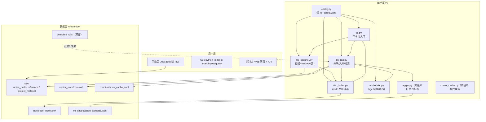
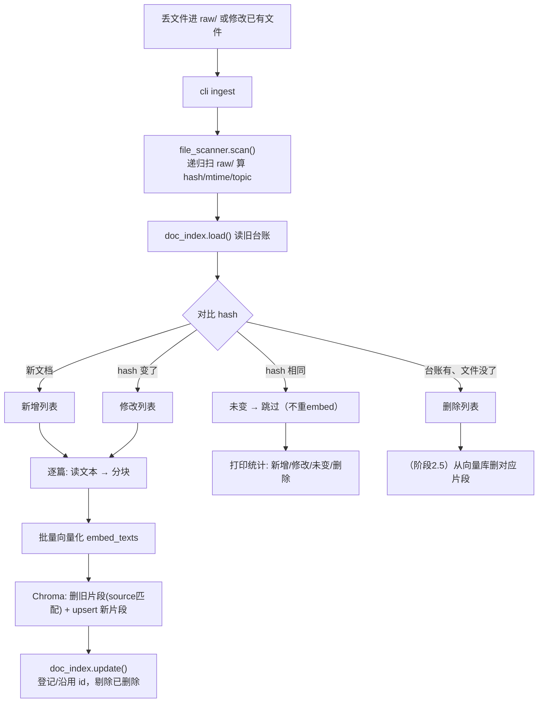
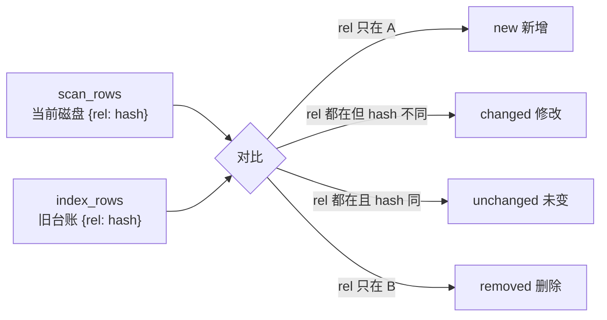
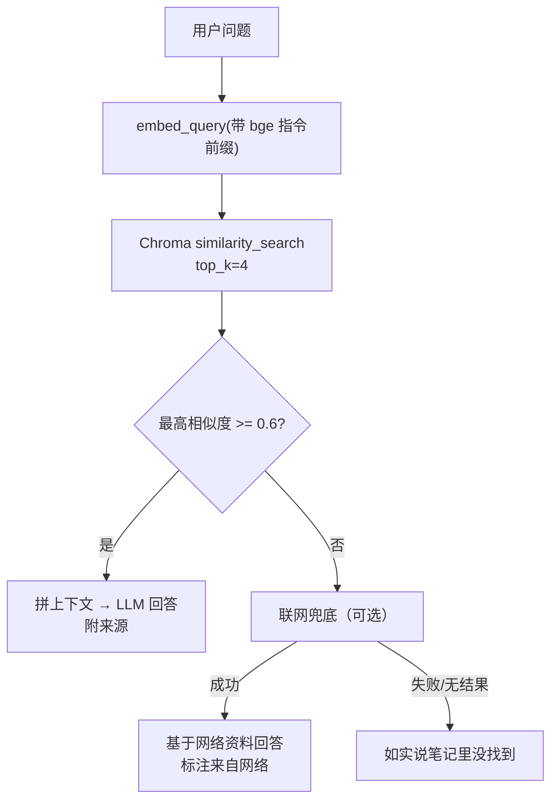
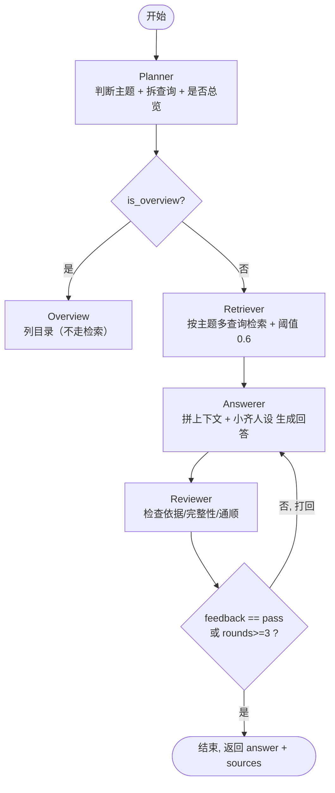
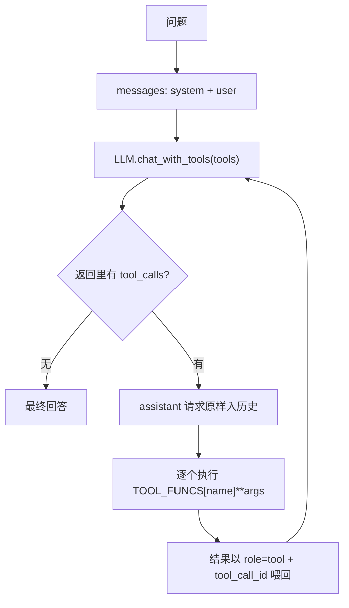
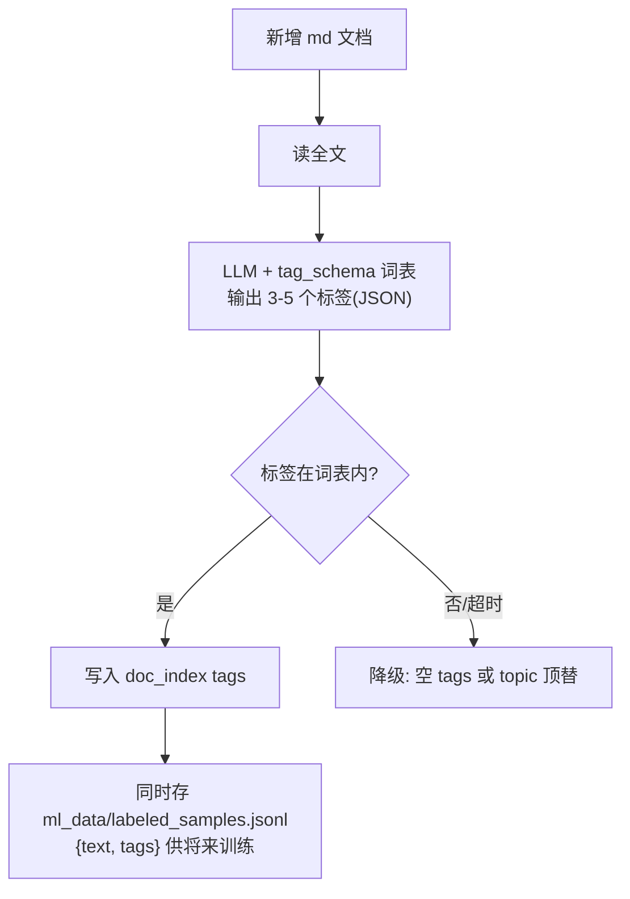
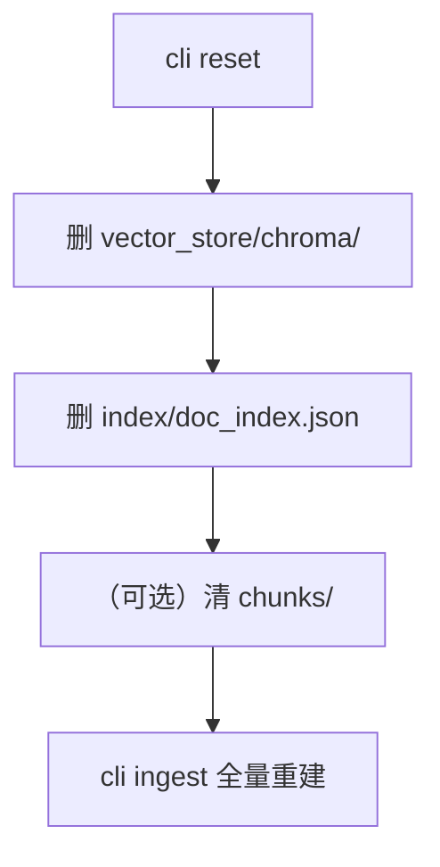
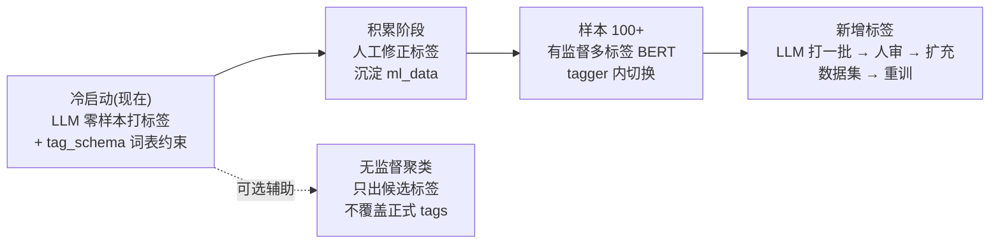

# 📘 kb-v2 个人知识库 项目计划书

> 版本：v2.0 ｜ 更新：2026-09-04 ｜ 状态：阶段 0-5 已实现，但存在若干待修复缺陷，6-8 预留
> 关联文档：旧项目《个人知识库》计划书 / 豆包《个人知识库目录设计与改造方案》/ README.md

---

## 一、项目概述

### 1.1 背景

旧项目《个人知识库》（D:\Python\Agent\个人知识库）完成了 FastAPI + Chroma + bge +
LangGraph 多 Agent 的教学验证。但旧项目的目录把「笔记」「向量库」「切片」混在一层，
没有文档台账（无法增量更新），也没有标签体系。参照新方案，把知识库**整体重构**为
「目录分层 + 模块化 kb 包 + inode 台账 + 增量更新 + 标签预留」的干净架构。

### 1.2 新项目位置与原则

| 项 | 说明 |
|---|---|
| 项目根 | `D:\Python\Agent\kb-v2`（英文目录，独立 git 仓库）|
| 旧项目 | `D:\Python\Agent\个人知识库` —— **保持不动**，只作代码资产参考 |
| 代码风格 | 模块化 `kb` 包，每模块职责单一、可独立自测 |
| 数据与代码分离 | 代码在 `kb/`，数据在 `knowledge/`，配置在根 `kb_config.yaml` |

### 1.3 目标

1. 一个人往 `knowledge/raw/` 丢 .md / .docx，系统自动完成：打标签 → 分块 → 向量化 →
   登记台账 → 可检索。
2. 支持增量更新：只处理「新增 / 修改」的文档，未变的跳过（省算力）。
3. 支持多领域：raw 顶层目录 = 领域/大分类，一篇笔记可有多个 tags（标签补充）。
4. 预留演进：compiled_wiki（范式3 编译层）、ml_data（有监督标签训练样本）、多知识库。

### 1.4 当前审查状态（2026-09-04）

- 主链路已接通：CLI / FastAPI / Chroma / LangGraph / 会话记忆都已落到代码里。
- 但当前版本仍有几个会影响可用性的边界问题：
  1. `static/index.html` 存在脚本语法错误，浏览器会直接报错。
  2. 会话文件命名调整后，旧格式缺少兼容读取。
  3. `pending/review` 和向量库 `source` 标识都还存在同名/路径冲突风险。
  4. Reviewer 只看 `hits`，没有把 `tool_result` 纳入审查依据。
- 结论：这是一版“功能已搭起，但需要补关键修正”的项目状态，不宜直接当成完全收尾版。

---

## 二、核心设计原则（一句话版）

1. **磁盘只管存放，逻辑分类交给元数据** —— 不做 01-xx 教程树，顶层目录只分大领域。
2. **向量库与原始笔记分离** —— 笔记在 `raw/`，向量库在 `vector_store/`，程序永不改笔记。
3. **自己维护一份台账 doc_index.json** —— 不依赖向量库存元数据，方便调试与增量。
4. **标签优先 LLM 零样本** —— 冷启动不需要标注数据；有监督等样本积累 100+ 再上。
5. **不推倒重写，分阶段迁移** —— 每阶段都能跑通，先闭环后复杂化。

---

## 三、总体架构



---

## 四、目录结构（定稿）

```
kb-v2/
├─ kb/                          # 代码包（Python）
│   ├─ __init__.py
│   ├─ config.py                # 读 kb_config.yaml，统一路径/参数
│   ├─ file_scanner.py          # 扫描 raw/，算 hash/mtime，对比台账分 增/改/删/未变
│   ├─ doc_index.py             # inode 台账读写（id 稳定 / hash 指纹 / tags）
│   ├─ embedder.py              # bge-small-zh 向量化（离线，懒加载）
│   ├─ kb_rag.py                # 分块 → 向量化 → Chroma 入库；检索 query / list_contents
│   ├─ tagger.py                # 【阶段2】LLM 零样本打标签 + tag_schema 约束
│   ├─ chunk_cache.py           # 【阶段2】切片缓存 jsonl 读写
│   └─ cli.py                   # 命令行：scan / ingest / query / list / reset
├─ knowledge/                   # 数据层
│   ├─ raw/                     # 原始笔记（人只动这里）
│   │   ├─ notes_draft/         #   自己的草稿、碎片、随手记
│   │   ├─ reference/           #   外部资料（教程摘抄、网页复制）
│   │   └─ project_material/    #   项目资料（毕设/实战）
│   ├─ compiled_wiki/           # 【预留】AI 编译聚合层（范式3，当前空）
│   ├─ chunks/                  # 【预留】切片缓存 chunk_cache.jsonl
│   ├─ index/                   # doc_index.json 台账（自动生成）
│   ├─ vector_store/chroma/     # Chroma 向量库（自动生成，可随时删）
│   ├─ temp/                    # 临时文件（程序可清空）
│   ├─ export/                  # 导出 / 备份
│   └─ ml_data/                 # 【预留】labeled_samples.jsonl（有监督训练样本）
├─ kb_config.yaml               # 知识库独立配置
├─ requirements.txt
├─ README.md
└─ 项目计划书.md                 # 本文件
```

> 迁移知识库 = 复制 `raw/ + index/ + vector_store/` 三个目录即可。

---

## 五、数据模型

### 5.1 台账 doc_index.json（仿 inode）

```json
{
  "notes_draft/示例-装饰器.md": {
    "id": "kb-0001",
    "topic": "notes_draft",
    "hash": "208487a1c68eee686c9cf2be8c4d6e0e",
    "mtime": 1788333714,
    "tags": []
  }
}
```

| 字段 | 含义 | 用途 |
|---|---|---|
| key | 相对 `knowledge/raw` 的路径 | 唯一标识一篇文档 |
| id | `kb-0001` 递增 | 仿 inode 稳定编号，同路径沿用不轻易变 |
| topic | 顶层目录名 | 检索过滤（目录=领域/分类）|
| hash | 文件内容 MD5 | 判断"改没改过" → 增量更新 |
| mtime | 文件修改时间 | 辅助检测 |
| tags | 字符串数组 | 【预留】标签，将来 LLM 自动填 |

### 5.2 向量库 metadata（每片段）

```json
{ "source": "示例-装饰器.md", "topic": "notes_draft", "heading": "# Python 装饰器" }
```

### 5.3 kb_config.yaml

```yaml
scan:    { raw_root: raw, file_suffix: [".md", ".docx"] }
split:   { chunk_size: 750, chunk_overlap: 120 }
embedding: { model_name: "BAAI/bge-small-zh-v1.5" }
recall:  { top_k: 4, score_threshold: 0.6 }
```

---

## 六、核心流程（流程图）

### 6.1 文档入库流水线（增量）



### 6.2 文件分类逻辑（file_scanner + doc_index）



### 6.3 检索问答（单 Agent RAG）



### 6.4 多 Agent 协作（LangGraph，阶段4，参考旧项目）



### 6.5 工具调用循环（Function Calling，阶段3）



### 6.6 自动打标签流程（阶段2，LLM 零样本）



### 6.7 删除与重建（维护流程）



---

## 七、模块设计（接口一览）

### kb/config.py
```python
KB_ROOT = Path(...).parent.parent          # 项目根
CONFIG = load_config()                     # 读 kb_config.yaml
raw_dir() -> Path                          # knowledge/raw
index_file() -> Path                       # knowledge/index/doc_index.json
chroma_dir() -> Path                       # knowledge/vector_store/chroma
split_cfg() / recall_cfg() / embedding_cfg() -> dict
```

### kb/file_scanner.py
```python
scan() -> dict                            # {rel: {topic, hash, mtime}}
classify(scan_rows, index_rows) -> dict   # {new, changed, unchanged, removed}
```

### kb/doc_index.py
```python
load() -> dict                            # 读台账
save(rows)                                # 写台账
next_id(existing) -> str                  # 分配 kb-NNNN
update(scan_rows) -> dict                 # 合并（保留 id / 剔除删除）
```

### kb/embedder.py
```python
embed_texts(texts) -> list[list[float]]   # 批量向量（归一化）
embed_query(query) -> list[float]         # 带 bge 指令前缀
```

### kb/kb_rag.py
```python
ingest(verbose=True) -> dict              # 增量入库，返回统计
query(question, topic="", top_k=0) -> list[dict]
list_contents() -> dict                   # {topic: [文件名]}
```

### kb/cli.py（命令）
```
python -m kb.cli scan       # 扫描看变化
python -m kb.cli ingest     # 入库
python -m kb.cli query "问题"
python -m kb.cli list
python -m kb.cli reset      # 清空重建
```

---

## 八、分阶段实施计划

> 每个阶段结束都可运行、可验证。✅ = 已完成。

### 阶段 0：骨架与配置 —— ✅
- [x] 建 knowledge 全套目录 + kb 包
- [x] kb_config.yaml + config.py
- 验收：`from kb.config import KB_ROOT` 打印正确路径

### 阶段 1：最小闭环（扫描→入库→检索）—— ✅
- [x] file_scanner / doc_index / embedder / kb_rag / cli
- [x] venv 装依赖
- [x] 示例笔记 + ingest + query 验证（命中 0.62，二次 ingest 增量跳过）
- 验收：`scan → ingest → query/list` 全通，台账生成 kb-0001

### 阶段 2：标签体系 + 切片缓存 —— ✅
- [x] `tagger.py`：LLM 零样本打标签（读 tag_schema.json 词表约束）
- [x] `chunk_cache.py`：切片 jsonl 缓存，避免重复分块
- [x] 入库流程接入 tagger + chunk_cache
- 验收：丢一篇新 md，ingest 后 doc_index 的 tags 非空

### 阶段 2.5：删除清理 —— ✅
- [x] ingest 里对 removed 文档：从向量库删对应片段（按 source）
- 验收：删文件 → ingest → query 不再命中

### 阶段 3：工具调用 + 入口 —— ✅（含超纲：tool_agent 接入 graph）
- [x] kb/agents/tools.py：TOOLS + TOOL_FUNCS + run_agent_with_tools 循环
- [x] execute_python 子进程真超时 + stderr/退出码处理
- [x] tool_agent 节点接入 graph（ReAct）——检索落空/需计算时 LLM 自主调工具
- 验收：`"用 python 算 2 的 10 次方"` 触发 execute_python

### 阶段 4：多 Agent 协作（LangGraph）—— ✅
- [x] Planner → Retriever → Answerer → Reviewer 图（迁移 + 重构进 kb/agents/）
- [x] Overview 节点 / 条件边打回 / 来源三态 / 阈值 0.6
- [x] 会话记忆：session_id + 最近 6 轮历史拼进 prompt
- [x] tool_agent（ReAct）节点：工具能力接入流程
- 验收：复杂问题触发重写循环，弱相关不硬答

### 阶段 5：Web 界面 + API（FastAPI）—— ✅（含超纲：上传流）
- [x] FastAPI：/api/ingest /api/chat /api/stats /api/upload /api/pending /api/review /api/ingest/progress
- [x] 前端：上传(批量+去重+自动分类+人工审查) / 进度条 / 参考来源折叠 / 会话记忆
- [x] PDF/docx/md 读取
- 验收：浏览器提问有回答 + 来源

### 阶段 6：compiled_wiki 编译层（范式3）—— ⬜ 待做（内容多了再开）
- [ ] 编译脚本读 raw → LLM 聚合 → 写 compiled_wiki 结构化 md
- [ ] 检索优先级：compiled_wiki 优先，raw 作溯源
- [ ] enable_compiled_layer: true
- 风险：LLM 聚合会幻觉 → raw 永远保留为证据

### 阶段 7：有监督标签模型 —— ⬜ 待做（样本 100+ 后）
- [ ] ml_data 标注样本积累
- [ ] bert-base-zh 多标签微调，tagger.py 内切换
- 路线：LLM 伪标注 → 人工修正 → 有监督微调

### 阶段 8：多知识库 —— ⬜ 待做（可选）
```
knowledge/
├─ default/   # 与现有结构一致，内部复用同一套 raw/index/...
├─ work/
└─ study/
```

---

## 九、标签体系演进路线



| 方案 | 冷启动 | 标签稳定 | 新增标签代价 | 用在哪 |
|---|---|---|---|---|
| 无监督聚类 | 直接跑 | 差(全局重跑会漂移) | 低 | 候选/关联挖掘 |
| LLM 零样本 | 直接跑 | 较好(prompt 约束) | 极低 | **阶段2 首选** |
| 有监督 BERT | 需标注样本 | 优秀 | 高(要重训) | 样本 100+ 后 |

---

## 十、风险与对策（含旧项目踩坑）

| # | 风险/坑 | 对策 |
|---|---|---|
| 1 | **GBK 控制台 emoji 崩溃**：print("📁") 在 Windows GBK 抛 UnicodeEncodeError → API 500 | 代码里 print 一律用纯文字 `[标记]`，禁止 emoji |
| 2 | chromadb telemetry 噪音报错 | 自测/脚本里 `$env:ANONYMIZED_TELEMETRY="False"`；不影响功能 |
| 3 | 向量库与笔记混杂、迁移困难 | 目录分层：笔记 raw/，向量 vector_store/，台账 index/ |
| 4 | 文件移动/改名致 id 变化 → 脏数据残留 | inode 台账：同 path 沿用 id；重导用 reset 兜底 |
| 5 | 全量重导慢（文件多时） | hash 增量：未变跳过；分块缓存 chunk_cache（阶段2） |
| 6 | 弱相关资料被硬答 | score_threshold=0.6：弱相关不给资料，转联网或明说 |
| 7 | LLM 打标签幻觉/超词表 | tag_schema 词表约束 + 降级空 tags |
| 8 | compiled_wiki 幻觉丢细节 | raw 永远保留为原始证据，wiki 只作优先检索层 |
| 9 | 前端脚本语法错误 | 浏览器页面无法初始化，所有交互失效 | 先做静态语法修复，再补一次浏览器回归 |
| 10 | 会话文件命名变更无兼容 | 旧会话列表/历史读取异常 | 读取旧文件并迁移，或做双格式兼容 |
| 11 | pending/review 文件名未净化 | 构造 filename 可触发越界读写 | 对 filename 做白名单净化 + 路径校验 |
| 12 | 向量库 source 只用文件名 | 不同目录同名文件会互相覆盖/误删 | source 改为 `topic/filename` 或 rel path |
| 13 | Reviewer 不看 tool_result | 工具型回答容易被空参考误判 | 审查时同时传入 `hits` 与 `tool_result` |

---

## 十一、测试与验证策略

1. **模块自测**：每个 kb/*.py 保留绿色标记打印（`\033[92m 文件名 \033[0m`），直接运行验证单模块。
2. **CLI 冒烟**：`scan → ingest → query → list` 全链 exit=0。
3. **增量测试**：不改文件二次 ingest → 输出 `未变N 片段0`。
4. **修改测试**：改笔记内容 → ingest → hash 变化 → 片段重导。
5. **新增文件测试**：raw 丢新 md → ingest → 台账新增 kb-NNNN。
6. **删除测试**（阶段2.5 后）：删文件 → ingest → query 不再命中。
7. **阈值测试**：问库里没有的内容 → 不返回弱资料。

---

## 十二、命令速查

```powershell
# 一次性（装依赖）
cd D:\Python\Agent\kb-v2
python -m venv .venv
.\venv\Scripts\python.exe -m pip install -r requirements.txt

# 日常
.\venv\Scripts\python.exe -m kb.cli scan
.\venv\Scripts\python.exe -m kb.cli ingest
.\venv\Scripts\python.exe -m kb.cli query "装饰器怎么写"
.\venv\Scripts\python.exe -m kb.cli list
.\venv\Scripts\python.exe -m kb.cli reset

# 消除 chromadb 遥测噪音
$env:ANONYMIZED_TELEMETRY = "False"
```

---

## 附：与旧项目资产对照

| 旧项目已验证资产 | kb-v2 去向 |
|---|---|
| bge-small-zh 离线 embedder | → kb/embedder.py（直接复用） |
| Chroma 余弦检索 + 0.6 阈值 | → kb/kb_rag.py |
| 分块逻辑（段落合并 + overlap） | → kb/kb_rag.py `_chunk_md` |
| 目录=章节 topic | → 顶层目录=领域 topic + tags 补充 |
| inode 台账（kb-NNNN + hash） | → kb/doc_index.py |
| LangGraph 多 Agent（阶段4） | 待迁移 |
| Function Calling 工具（阶段3） | 待迁移 |
| FastAPI + 前端（阶段5） | 待迁移 |
